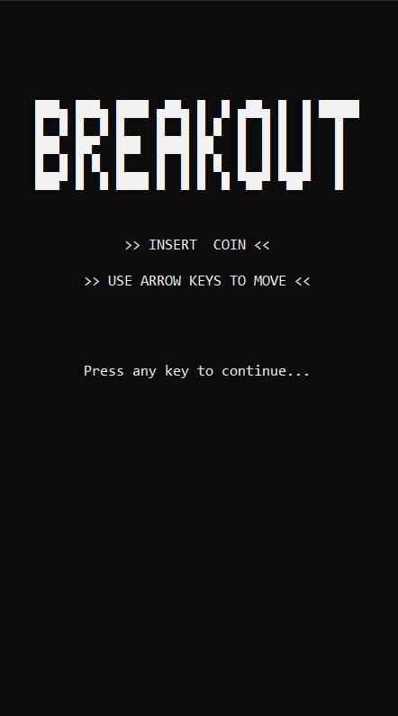
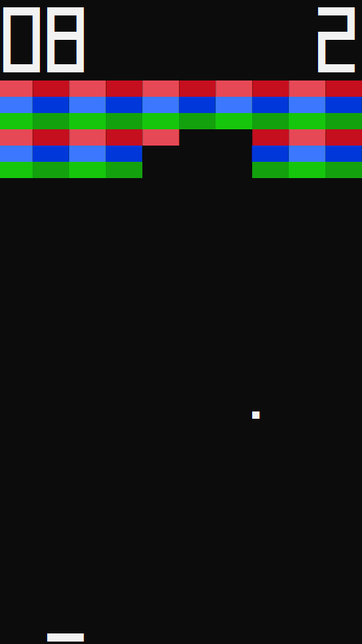

# Breakout game
Old Atari game recreated in C# back in 2020. It runs in a terminal. The size of a game window and game default speed can be changed by editing input parameters in Game.Start(). The game contains score and lives counter, basic brick-breaking animation, and basic sound effects. The speed of the ball is increasing during the game.

### Welcome screen

### Game

